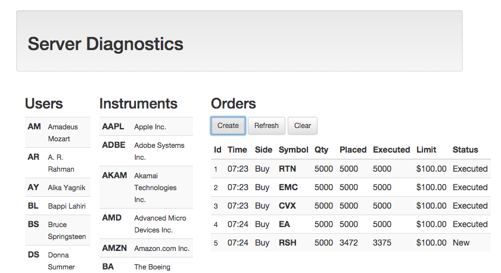

Trader Desktop Server Diagnostics
=================================

This web application is used to exercise the functionality of the [Trader Desktop](https://github.com/archfirst/trader-desktop) server. It is also very instructive in understanding the server API.

Build Instructions
------------------
* Clone this repository on your machine.
* Open a command shell and change the directory to the local instance of the repository.
* Install the required NPM packages:

        $ npm install
* Start the application using the following command:

        $ grunt

This will open the diagnostics web application in your browser. It can also be launched manually by pointing your browser to [http://localhost:9000](http://localhost:9000).

Here's a screen shot of the application:

